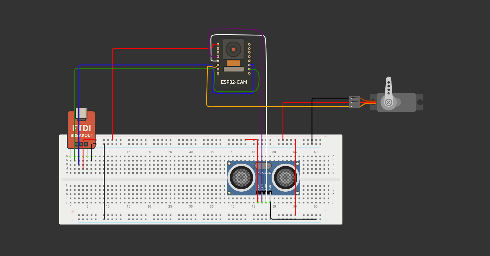

## 🚗 Controllo accessi intelligente con ESP32-CAM

  

Questo progetto realizza un sistema di riconoscimento automatico delle targhe (ALPR) per il controllo accessi veicolari, utilizzando una ESP32-CAM, un sensore a infrarossi, un servomotore e un microcontrollore Arduino. Il sistema rileva automaticamente l’arrivo di un veicolo, scatta una foto alla targa, la invia a un servizio cloud per il riconoscimento, e apre una sbarra automatica simulata se la targa è autorizzata.

## 🔧 Funzionalità principali
- Rilevamento veicolo tramite sensore a infrarossi
- Scatto automatico della foto con ESP32-CAM
- Invio immagine al cloud per riconoscimento targa (ALPR)
- Verifica della targa autorizzata da Arduino
- Apertura automatica della sbarra con un servomotore
- Chiusura automatica dopo alcuni secondi

## 🧰 Componenti utilizzati

| Componente         | Descrizione                                  |
|--------------------|----------------------------------------------|
| ESP32-CAM          | Microcontrollore con fotocamera integrata    |
| Sensore a infrarossi | Rileva la presenza di un veicolo            |
| Arduino Uno/Nano   | Controllore logico e gestione servo          |
| Servo Motore       | Simula apertura/chiusura della sbarra        |
| FTDI Breakout Module    | Alimentazione dei moduli e flash del programma|

## 📸 Flusso di funzionamento
- Il sensore IR rileva la presenza di un veicolo.
- L’ESP32-CAM scatta una foto e la invia al cloud (via HTTP).
- Il cloud restituisce il numero di targa riconosciuto.
- Arduino confronta la targa con una whitelist predefinita.
- Se autorizzata, il servomotore apre la sbarra per alcuni secondi.
- Dopo il timeout, la sbarra si richiude automaticamente.

## 🔌 Schema del circuito

## ☁️ Riconoscimento targa (ALPR)
Il servizio cloud esterno per l'analisi dell'immagine è:
[CircuitDigest](https://www.circuitdigest.cloud/)

## 💡 Possibili estensioni
- Integrazione con database remoto (Firebase, MySQL)
- Interfaccia web per gestire le targhe autorizzate
- Log degli accessi con timestamp
- Notifiche via Telegram o e-mail

## 🎓 Progetto accademico
Questo progetto è stato realizzato come parte dell’esame del corso di **Laboratorio di Making**.
